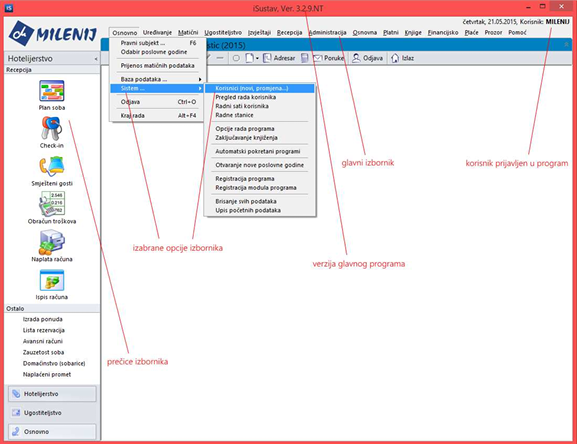
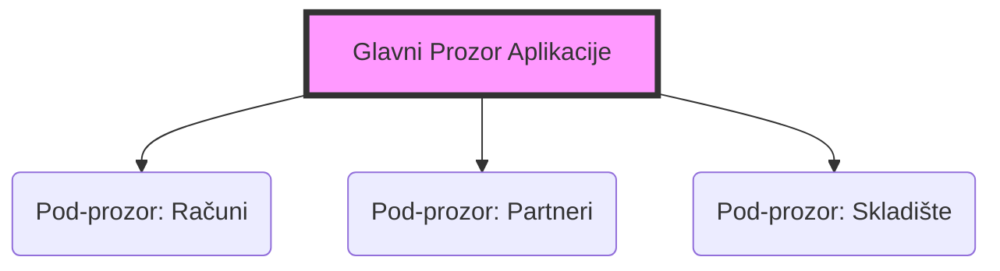

# Osnovni pojmovi i konvencije

U ovom dijelu uputa ukratko ćemo objasniti pojmove, oznake, simbole i konvencije s kojima ćete se često susretati koristeći naš program.

<iframe width="560" height="315" src="https://www.youtube.com/embed/u5doPxsXLnc"frameborder="0" allow="accelerometer; autoplay; encrypted-media; gyroscope; picture-in-picture" allowfullscreen></iframe>


## Glavni prozor

Glavni prozor se otvara svakim pozivanjem programa. To je "okvir" unutar kojega se otvaraju svi ostali prozori (tzv. MDI sučelje).

!!! danger "Zatvaranje programa"
    Zatvaranjem glavnog prozora programa automatski se zatvaraju i svi ostali otvoreni prozori, tj. **prekida se rad programa**.



### Struktura prozora

Ovaj dijagram prikazuje hijerarhiju prozora u programu:



Kada imate otvorenih više modula, preglednije je vidjeti koji prozori pripadaju kojem programu nego kad se nalaze svuda po desktopu. Minimiziranjem glavnog prozora minimiziraju se i svi njegovi zavisni prozori.

- - -

## Glavni izbornik (Meni)

Svaka opcija na glavnom meniju predstavlja jedno područje rada.

!!! info "Konvencija pisanja u uputama"
    Kako ove upute ne bismo pretvorili u slikovnicu, putanju do određene opcije pisat ćemo skraćeno.

```
Primjer: **Osnovno -> Sistem -> Korisnici**

1. Kliknite na **Osnovno** (Glavni izbornik).
2. Odaberite **Sistem** (Padajući izbornik).
3. Odaberite **Korisnici** (Podizbornik).
```

- - -

## Tipkovnica

Tipkovnica se sastoji od dva dijela: slovnog i numeričkog. Desni dio tipkovnice (numerički) ključan je za brz unos podataka.

!!! warning "Važna napomena: NumLock"
    Pazite da je tipka **NumLock** uvijek uključena!
    Lampica na tipkovnici mora svijetliti kako biste mogli nesmetano upisivati cijene, količine i šifre.

- - -

## Aktivna komponenta (Fokus)

Kako znati gdje trenutno upisujete podatku? U Windows okruženju to zovemo polje "u fokusu".

| Stanje            | Izgled na ekranu                              |
| ----------------- | --------------------------------------------- |
| **Aktivno dugme** | Dobiva točkasti okvir oko sebe i masna slova. |
| **Polje za upis** | Mijenja boju (npr. u žutu ili plavu).         |
| **Tabela**        | Zaglavlje ili redak mijenja boju.             |

- - -

## Polje za upis datuma

Polja za datum su "pametna" polja koja ubrzavaju unos. Kada je polje aktivno, ono poplavi.

Evo kako možete ubrzati rad s datumima:

\=== "Prečaci na tipkovnici"
    Koristite ove tipke za brzu promjenu datuma bez pisanja:

```
* `+` (Plus) : Povećava datum za jedan dan.
* `-` (Minus) : Smanjuje datum za jedan dan.
* `D` (Slovo D) : Automatski upisuje **Današnji** datum.
```

\=== "Pametni unos"
    Ne morate pisati točke ni pune godine. Program razumije skraćeni unos:

```
* Unos **15** -> Program pretvara u: `15.03.2024.` (tekući mjesec i godina)
* Unos **1502** -> Program pretvara u: `15.02.2024.` (tekuća godina)
* Unos **150223** -> Program pretvara u: `15.02.2023.`
```

- - -

## Odjava korisnika

Kada se radnici mijenjaju (npr. smjena), nije potrebno gasiti program. Dovoljno je odjaviti se.

Postoje tri načina za odjavu:

1. Putem izbornika: **Osnovno -> Odjava korisnika**.
2. Putem tipkovnice: Pritisnite `Ctrl` + `O`.
3. Putem ikone: Kliknite na čovječuljka ("Odjava") na alatnoj traci.

!!! tip "Savjet"
    Novi korisnik se odmah nakon toga može prijaviti svojim imenom i šifrom bez ponovnog pokretanja aplikacije.
